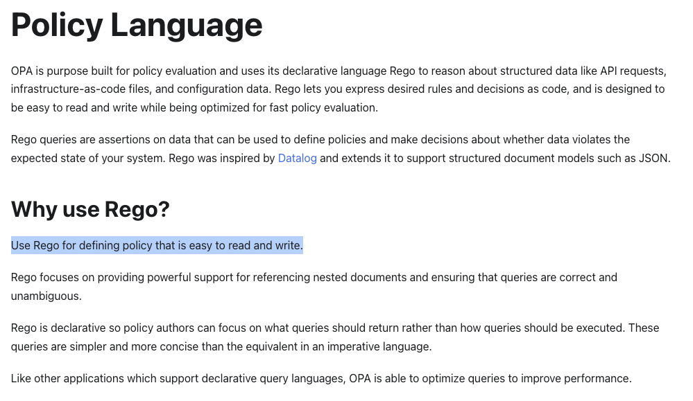
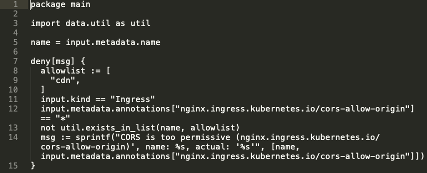
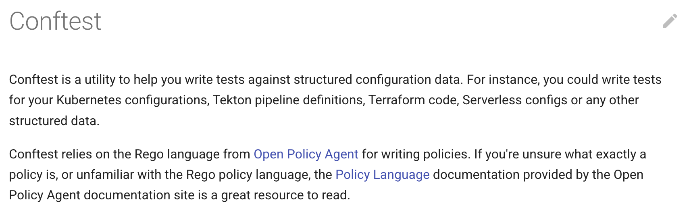
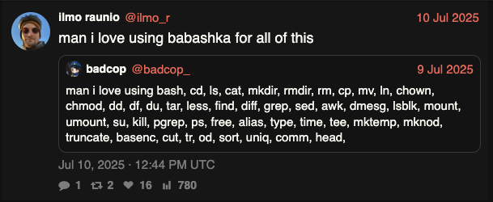
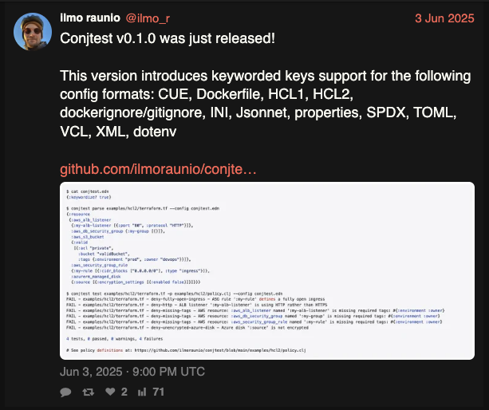
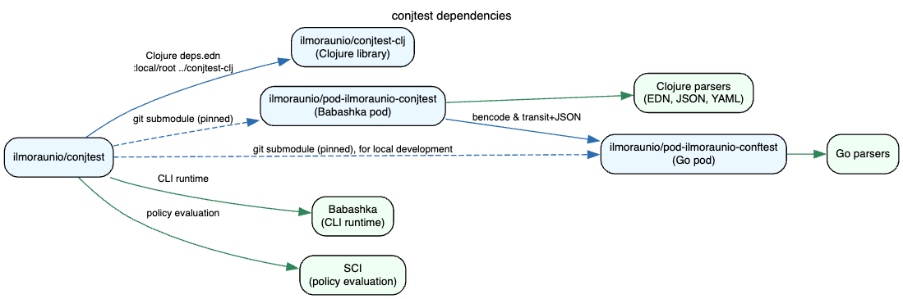
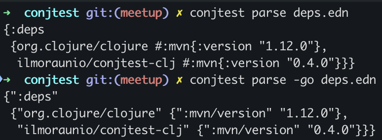

<!--
In this presentation I'm going to talk about using Go together with Clojure, Babashka, and Babashka pods to create a policy as code tool based on a popular existing open source tool.
-->

<style>
/* Prevent Marp from shrinking code blocks */
pre, pre code {
  font-size: 15px !important;   /* ← set your exact size */
  line-height: 1.2;
  white-space: pre;             /* no wrapping */
  overflow-x: auto;             /* horizontal scrollbar */
  overflow-y: auto;             /* vertical scrollbar */
}

p {
  font-size: 0.9em;
}


ul, li {
  font-size: 0.95em;
}
</style>

# Using Go & Clojure with Babashka pods to create Conjtest

Exploring a Policy as Code tool made using Clojure, Babashka, Babashka pods, and Go.

---
<!--
SOK: Finland's leading retail cooperative
-->

# Whoami

```
$ whoami
ilmo.raunio
```

- Currently at SOK in S-ID team (some Clojure services, mainly TypeScript)
  - As security champion, do a lot of threat modeling & think about prevention mechanisms
  - Teach people how to do Site Reliability Engineering (SRE), improve observability
  - Gospel about Clojure and try to make people fall in love with it
- Ex-Metosin
  - Maintainer of [metosin/oksa](https://github.com/metosin/oksa), a small GraphQL query library
- Father of two kids & passionate Japanese cuisine enthusiast

---
<!--
First it's probably a good idea to define what we mean by policy as code.

This is a definition from Hashicorp, the creators of Terraform and Sentinel.

(Read bolded definition)
-->

# Policy as Code

> Policy as code gives you an automated way to check, in seconds, if your IT and business stakeholders’ requirements are being followed — in every deployment. **A policy as code framework includes a policy coding language that can be tested, peer reviewed, versioned, automated, and re-used much like application or infrastructure code.**

Emphasis mine.

https://www.hashicorp.com/en/blog/policy-as-code-explained

---
<!--
An example of a policy as code tool which I'm going to be focusing throughout this talk is called Conftest. It uses Rego which is a declarative query language inspired by Datalog.

I first started using Conftest when I was working at a project under Metosin and I needed to introduce rules to our infrastructure to prevent some security configurations from being overly permissive.

Below is a rule which prevents us from placing an asterisk value for a particular security header for ingress (or nginx) instances in Kubernetes. We hooked this to our CI and prevented the CI from continuing if the rule did not pass.

This worked for us, and the tool is used by many DevOps and SRE teams across the world, but being a Clojure developer in a Clojure team I of course wanted something more which wasn't available at the time.
-->
<style scoped>
.conftest {
  position: fixed;
  top: 200px;
  right: 50px;
  border: 1px solid #333;
}
</style>

<a href="https://developer.hashicorp.com/sentinel/docs/language"></a>



---
<!--
What I wanted was a way to define rules using Clojure functions. This is because I believe Clojure can be a simpler way to define rules for your data. Clojure also has a lot of core functionality available for data inspection, something which was maybe a bit lacking in Rego. I also liked the boolean semantics of Clojure more.

I wanted to be able to parse many different configuration formats, not just EDN, JSON, or YAML, but other file formats as well such as Dockerfile or Terraform configuration.

Clojure didn't have support for this out of the box, but the Go ecosystem did.

Hence the idea began, whether these two ecosystems could be combined through Conftest and the parsers provided by the Go ecosystem.
-->

## Initial requirements


- Define policy-as-code using Clojure
- Support for many config formats: CUE, CycloneDX, Dockerfile, EDN, .env, HCL, HOCON, Ignore files, INI, JSON, Jsonnet, Properties, SPDX, TextProto, TOML, VCL, XML, YAML

Clojure doesn't have this level of support, while Go does (collated via projects like <a href="https://conftest.dev">Conftest</a>)

---
<!--
Let's look at Babashka and Babashka pods next.
-->


# Enter Babashka

A short dive into Babashka & Babashka pod protocol

---
<!--
So what is Babashka...? 

Just to quickly summarize, Babashka is a Clojure for bash, created by Michiel Borkent (or borkdude). It allows you to script using the Clojure core and extensive Babashka libraries.

It also has a fast startup thanks to GraalVM compilation.
-->

## What's Babashka?



- Native Clojure interpreter for scripting with fast startup (uses GraalVM under the hood)
- Allows you to use Clojure in places where you would be using bash otherwise
- Maintained by [borkdude](https://github.com/borkdude) (Michiel Borkent)

---
<!--
This is a simple example of how to list public directories on your home directory using Babashka. It uses basic Clojure core functions and babashka.fs (file system) library.
-->

```clojure
bb -e '(str (fs/cwd))'
; => "/Users/ilmo.raunio"

bb -e '(->> (fs/list-dir ".") 
         (filter fs/directory?)
         (map fs/normalize)
         (map str)
         (filter (complement #(clojure.string/starts-with? % "."))))'
; => ("Devel" "Music" "go" "Pictures" "Desktop" "Library" "epic-workshops" "Public" "Movies" "Documents" "Downloads")
```

---
<!--
Moving forward to Babashka pods...

Babashka pods are libraries meant to be called from within Babashka, except that you can use any language to write them in, such as Go, Haskell, or Rust.

You just need to implement the Babashka pod protocol to the pod, and add some glue code to the pod client itself.
-->

## What are Babashka pods?

- Programs that can be used as Clojure libraries inside Babashka.
- Pods can be built in Clojure, but also in languages that don't run on the JVM.
  - Eg: Go, Haskell, Rust.
- Pods can be created independently from pod clients. Any program can be invoked as a pod as long as it implements the pod protocol.

---
<!--
So what is the pod protocol?

Exchange of messages between pod client and the pod which happen in the bencode format

You have opcodes such as describe, invoke, and shutdown. The code example is what a describe response looks like.

Payloads like args (arguments) or value (a function return value) are encoded in either EDN, JSON or Transit JSON.
-->


## Babashka pod protocol

- Exchange of messages between pod client and the pod which happen in the bencode format
- Protocol uses opcodes like "describe", "invoke", "shutdown", etc.
- Additionally, payloads like args (arguments) or value (a function return value) are encoded in either EDN, JSON or Transit JSON

```clojure
(bencode/write-bencode System/out {"op" "describe"})
; => d2:op8:describee
```

```clojure
;; expected pod response
{"format" "json"
 "namespaces"
 [{"name" "pod.lispyclouds.sqlite"
   "vars" [{"name" "execute!"}]}]
 "ops" {"shutdown" {}}}
```

https://github.com/babashka/pods#the-protocol

---
<!--
Bencode is a serialization format which supports simple values like byte strings, integers, lists, and dictionaries.

Babashka uses bencode serialization to encode the message from the pod client to the pod, and back again.
-->

## Bencode quick intro

- Supports the following types of values:
  - byte strings
  - integers
  - lists (arrays)
  - dictionaries (associative arrays)
- Babashka pods uses bencode to encode the message from the pod client to the pod, and vice versa

---
<!--
This is an example of a pod invocation.

We see the parse function being invoked with a list containing the filename: bb.edn (first example)

The pod-client response is passed to the pod itself, which produces the contents of bb.edn in bencode format (second example)

And this is what the response looks like when decoded (last example)
-->


## Pod invocation example

```clojure
user=> (bencode/write-bencode System/out {"op" "invoke"
                                          "id" "fa18772a-7159-47fb-96b8-7426d4c8891e"
                                          "var" "pod.ilmoraunio.conftest/parse"
                                          "args" "[\"~#list\",[\"bb.edn\"]]"})
; => d4:args21:["~#list",["bb.edn"]]2:id36:fa18772a-7159-47fb-96b8-7426d4c8891e2:op6:invoke3:var29:pod.ilmoraunio.conftest/parseenil
```

```bash
$ ./pod-ilmoraunio-conftest
d4:args21:["~#list",["bb.edn"]]2:id36:fa18772a-7159-47fb-96b8-7426d4c8891e2:op6:invoke3:var29:pod.ilmoraunio.conftest/parseenil

d2:id36:fa18772a-7159-47fb-96b8-7426d4c8891e6:statusl4:donee5:value438:["^
","bb.edn",["^ ",":tasks",["^ ","test",["^
",":requires",[["conjtest.bb.main",":as","main"]],":task",["main/test","*command-line-args*"]],"parse",["^
","^3",[["conjtest.bb.main",":as","main"]],"^4",["main/parse","*command-line-args*"]]],":paths",["src","pod-ilmoraunio-conjtest/src","resources/"],":deps",["^
","org.conjtest/conjtest-clj",["^ ",":mvn/version","0.4.0"]],":pods",["^
","ilmoraunio/conftest",["^ ",":version","0.1.1"]]]]e
```

<sub><sup>Decoding:</sup></sub>

<div>
<pre>
user=> (clojure.pprint/pprint (bencode->clj "d2:id36:fa18772a-7159-47fb-96b8-7426d4c8891e6:statusl4:donee5:value438:[\"^ \",\"bb.edn\",[\"^ \",\":tasks\",[\"^ \",\"test\",[\"^ \",\":requires\",[[\"conjtest.bb.main\",\":as\",\"main\"]],\":task\",[\"main/test\",\"*command-line-args*\"]],\"parse\",[\"^ \",\"^3\",[[\"conjtest.bb.main\",\":as\",\"main\"]],\"^4\",[\"main/parse\",\"*command-line-args*\"]]],\":paths\",[\"src\",\"pod-ilmoraunio-conjtest/src\",\"resources/\"],\":deps\",[\"^ \",\"org.conjtest/conjtest-clj\",[\"^ \",\":mvn/version\",\"0.4.0\"]],\":pods\",[\"^ \",\"ilmoraunio/conftest\",[\"^ \",\":version\",\"0.1.1\"]]]]e"))
</div>
</pre>

<div>
<pre>
{"id" "fa18772a-7159-47fb-96b8-7426d4c8891e",
 "status" ["done"],
 "value"
 "[\"^ \",\"bb.edn\",[\"^ \",\":tasks\",[\"^ \",\"test\",[\"^ \",\":requires\",[[\"conjtest.bb.main\",\":as\",\"main\"]],\":task\",[\"main/test\",\"*command-line-args*\"]],\"parse\",[\"^ \",\"^3\",[[\"conjtest.bb.main\",\":as\",\"main\"]],\"^4\",[\"main/parse\",\"*command-line-args*\"]]],\":paths\",[\"src\",\"pod-ilmoraunio-conjtest/src\",\"resources/\"],\":deps\",[\"^ \",\"org.conjtest/conjtest-clj\",[\"^ \",\":mvn/version\",\"0.4.0\"]],\":pods\",[\"^ \",\"ilmoraunio/conftest\",[\"^ \",\":version\",\"0.1.1\"]]]]"}
</div>
</pre>

---
<!--
There is a pod registry which is maintained by borkdude.

(Click link)

And you can require those pods as libraries in your Babashka scripts.
-->

## Pod registry

https://github.com/babashka/pod-registry

### Pod examples

- Go: https://github.com/babashka/pod-babashka-go-sqlite3
- Rust: https://github.com/babashka/pod-babashka-filewatcher
- Haskell: https://github.com/rorokimdim/stash

---
<!--
After some years of hammock time thinking how I could achieve this, and finally months of development in the spring and summer of 2025, I managed to push the first version of Conjtest out.
-->




Thanks to Babashka, Babashka pods, and the Go ecosystem, this idea became possible.

---

# Demo time

https://github.com/ilmoraunio/conjtest/tree/main?tab=readme-ov-file#quickstart

---
<!--
Looking at the big picture here

We produce a single binary for macOS and linux called conjtest.

We are using SCI (Small Clojure Interpreter) to run the rules inside a sandbox.

We have a Babashka pod called pod-ilmoraunio-conjtest which uses some Clojure parsers like EDN, JSON, YAML, but it also delegates to the Go pod (conftest) when it's not able to find a suitable parser anymore.

Finally, the pods and the rule engine is published separately as a set of libraries which allows for custom scripting through Babashka.
-->



- conjtest (x86 & arm64 binaries)
- conjtest-clj, pod-ilmoraunio-conjtest, pod-ilmoraunio-conftest are published separately as libraries/pods
  - allows for custom scripting via Babashka, can even BYOParser

---
<!--
This is a code example from the Go pod

Here we see the functions such as parse or parse-as being exposed through the Describe opcode.

This tells Babashka what namespaces and vars it should create.

We also see how the parse function delegates the call to conftest parser.
-->

```go
// pod-ilmoraunio-conftest (main.go)

import (
    …
    "github.com/open-policy-agent/conftest/parser"
    …
)

func processMessage(message *babashka.Message) {
    switch message.Op {
    case "describe":
        babashka.WriteDescribeResponse(
            &babashka.DescribeResponse{
                Format: "transit+json",
                Namespaces: []babashka.Namespace{
                    {
                        Name: "pod.ilmoraunio.conftest",
                        Vars: []babashka.Var{
                            {
                                Name: "parse",
                            },
                            {
                                Name: "parse-as",
                            },
                        },
                    },
                },
            })
    case "invoke":
        switch message.Var {
        case "pod.ilmoraunio.conftest/parse":
            args, err := parseArgs(message.Args)
            if err != nil {
                babashka.WriteErrorResponse(message, err)
                return
            }

            configs, err := parser.ParseConfigurations(args)
            if err != nil {
                babashka.WriteErrorResponse(message, err)
                return
            } else {
                respond(message, configs)
            }
…
```

---
<!--
And this is what the Babashka pod looks like

We see that pods can have shutdown opcode as well.

This gives the pod a chance to clean up resources before it exits. If the pod does not support the shutdown op, the pod process is killed by the pod client.
-->

```clojure
;; pod-ilmoraunio-conjtest

(defn -main []
  (loop []
    (let [message (try (read-bencode stdin)
                       (catch EOFException _
                         ::EOF))]
      (debug "message" message)
      (when-not (identical? ::EOF message)
        (let [op (-> message (get "op") bytes->string keyword)
              id (or (some-> message (get "id") bytes->string)
                     "unknown")]
          (case op
            :describe (do
                        (debug "got :describe")
                        (debug "responding with" (pr-str @describe-map))
                        (write-bencode stdout @describe-map)
                        (recur))
            :invoke (do
                      (debug "got :invoke")
                      (try
                        (let [response (dispatch message)] ; <-- ENHANCE
                          (debug "responding with" (pr-str response))
                          (write-bencode stdout response))
                        (catch Throwable e
                          (->> e (error-response id) (write-bencode stdout))))
                      (recur))
            :shutdown (do
                        (debug "shutting down")
                        (System/exit 0))
            (do
              (let [response {"ex-message" "Unknown op"
                              "ex-data"    (pr-str {:op op})
                              "id"         id
                              "status"     ["done" "error"]}]
                (write-bencode stdout response))
              (recur))))))))
```

---
<!--
And here is the dispatcher which handles delegation to the API functions in the underlying Go pod.
-->

```clojure
;; pod-ilmoraunio-conjtest

(defn dispatch
  [message]
  (debug message)
  (let [id (bytes->string (get message "id"))
        _ (debug "id" id)
        var (bytes->string (get message "var"))
        _ (debug "var" var)
        args (-> (get message "args") bytes->string edn/read-string)
        _ (debug "args" args)
        value (case var
                "pod-ilmoraunio-conjtest.api/parse" (apply api/parse args)
                "pod-ilmoraunio-conjtest.api/parse-as" (apply api/parse-as args)
                "pod-ilmoraunio-conjtest.api/parse-go" (apply api/parse-go args)
                "pod-ilmoraunio-conjtest.api/parse-go-as" (apply api/parse-go-as args)
                "pod-ilmoraunio-conjtest.api/parse*" (apply api/parse* args)
                "pod-ilmoraunio-conjtest.api/parse-as*" (apply api/parse-as* args)
                "pod-ilmoraunio-conjtest.api/parse-go*" (apply api/parse-go* args)
                "pod-ilmoraunio-conjtest.api/parse-go-as*" (apply api/parse-go-as* args))
        _ (debug "value" value)]
    {"value" (pr-str value)
     "id" id
     "status" ["done"]}))
```

---

# Conjtest features

---
<!--
Policies or rules are single-arity functions where the argument is the input data. To return a violation for a rule, depends on its rule type. For a deny & warn rule, a truthy value produces a violation. For an allow rule, a falsey value produces a violation.

And this results in a different kind of exit code based on the rule type. A deny & warn rule will produce an exit code of 1, and a warn rule will produce 0 even if it is in violation.
-->

#### Rule types

```clojure
;; Allow rule
(defn allow-my-absolute-bare-rule
  [input]
  (and (= "v1" (:apiVersion input))
       (= "Service" (:kind input))
       (= 80 (-> input :spec :ports first :port))))

;; Deny rule
(defn deny-my-absolute-bare-rule
  [input]
  (and (= "v1" (:apiVersion input))
       (= "Service" (:kind input))
       (not= 80 (-> input :spec :ports first :port))))

;; Warn rule
(defn warn-my-absolute-bare-rule
  [input]
  (and (= "v1" (:apiVersion input))
       (= "Service" (:kind input))
       (not= 80 (-> input :spec :ports first :port))))
```

---
<!--
Conjtest also supports returning custom error messages.

Returning a string from the function will always result in a violation.
-->

## Custom error message

Function may also return a failure message (string) to indicate a violation.

```clojure
(defn deny-should-not-run-as-root
  [input]
  (let [name (-> input :metadata :name)]
    (when (and (deployment? input)
               (true? (get-in input [:spec :template :spec :securityContext :runAsNonRoot])))
      (format "Containers must not run as root in Deployment \"%s\"" name))))
```

---
<!--
It's also possible to return multiple error messages. This currently shows up as a single violation but prints out all of the errors. Here we are using the for macro, but you can use anything, for example map.

Btw, using the for macro like this is OK. Conjtest tolerates empty collections as a rule success and doesn't produce a violation.
-->

## Multiple error messages

Function may also return a non-empty collection of error messages.

```clojure
(defn deny-missing-tags
  [input]
  (for [[resource-type resources] (:resource input)
        [resource-name resource-definitions] resources
        resource-definition resource-definitions
        :let [tags (into #{} (keys (:tags resource-definition)))
              missing-tags (clojure.set/difference (clojure.set/union tags required-tags) tags)]
        :when (and (clojure.string/starts-with? (name resource-type) "aws_") (pos? (count missing-tags)))]
    (format "AWS resource: %s named '%s' is missing required tags: %s" resource-type resource-name missing-tags)))
```

```bash
$ conjtest test examples/hcl2/terraform.tf -p examples/hcl2/policy.clj
FAIL - examples/hcl2/terraform.tf - deny-missing-tags - AWS resource: :aws_db_security_group named ':my-group' is missing required tags: #{:environment :owner}
FAIL - examples/hcl2/terraform.tf - deny-missing-tags - AWS resource: :aws_security_group_rule named ':my-rule' is missing required tags: #{:environment :owner}
FAIL - examples/hcl2/terraform.tf - deny-missing-tags - AWS resource: :aws_alb_listener named ':my-alb-listener' is missing required tags: #{:environment :owner}

1 tests, 0 passed, 0 warnings, 1 failures
```

---
## Declarative policies

Malli schemas are evaluated using <code>malli.core/validate</code> after which they are processed for any errors using <code>malli.core/explain</code> and <code>malli.error/humanize</code>.

```clojure
(ns policy)

(def allow-declarative-example
  [:map
   [:kind [:= "Deployment"]]
   [:metadata
    [:map
     [:name :string]]]
   [:spec
    [:map
     [:selector
      [:map
       [:matchLabels
        [:map
         [:app :string]
         [:release :string]]]]]
     [:template
      [:map
       [:spec
        [:map
         [:securityContext {:optional true}
          [:map
           [:runAsNonRoot [:not= {:error/message "Containers must not run as root"}
                           true]]]]]]]]]]])
```

---
<!--
This is an example showcasing how to use Conjtest through Babashka, if you don't want to use the binary. This really enables you to import whatever library that you want, whatever custom reporter that you need, or whatever parsers that are still missing.
-->

## DIY - Using conjtest through Babashka as a dependency

```clojure
;; bb.edn
{:paths ["."]
 :deps {org.conjtest/conjtest-clj {:mvn/version "0.4.0"}}
 :pods {ilmoraunio/conjtest {:version "0.1.2"}}
 :tasks
 {:requires ([main])
  test (apply main/test *command-line-args*)}}
```
```clojure
;; main.clj
(ns main
  (:require [conjtest.core :as conjtest]
            [pod-ilmoraunio-conjtest.api :as parser]
            [policy]))

(defn test
  [& args]
  (let [inputs (apply parser/parse args)]
    (let [{:keys [summary-report failure-report]}
          (conjtest/test inputs 'policy)]
      (cond
        failure-report (do (println failure-report) (System/exit 1))
        summary-report (do (println summary-report) (System/exit 0))))))
```

```
bb test sample_config.edn
```


---
<!--
When we develop our policies, we also want to debug them while we are fixing or implementing them. With Clojure this is pretty easy using the print function, but I also wanted to provide some other ways to develop the system more interactively.
-->

# Debugging

- `println`, `prn`, `print`
- Tracing (`conjtest test … --trace`)
- REPL (`conjtest repl`)

---
<!--
This is a tracing example that shows you the rule name, the input file, the parsed input, and its result when it has been executed.
-->

## Tracing

```bash
$ conjtest test test-resources/invalid.yaml --policy test-resources/conjtest/example_deny_rules.clj --trace

Policy argument(s): test-resources/conjtest/example_deny_rules.clj
Filenames parsed: test-resources/invalid.yaml
Policies used: test-resources/conjtest/example_deny_rules.clj
TRACE:
---
...
Rule name: deny-my-rule
Input file: test-resources/invalid.yaml
Parsed input: {:apiVersion "v1",
 :kind "Service",
 :metadata {:name "hello-kubernetes"},
 :spec
 {:type "LoadBalancer",
  :ports ({:port 81, :targetPort 8080}),
  :selector {:app "bad-hello-kubernetes"}}}
Result: true
...
FAIL - test-resources/invalid.yaml - deny-malli-rule - :conjtest/rule-validation-failed
FAIL - test-resources/invalid.yaml - deny-my-absolute-bare-rule - :conjtest/rule-validation-failed
FAIL - test-resources/invalid.yaml - deny-my-bare-rule - port should be 80
FAIL - test-resources/invalid.yaml - deny-my-rule - port should be 80
FAIL - test-resources/invalid.yaml - differently-named-deny-rule - port should be 80

5 tests, 0 passed, 0 warnings, 5 failures
```

---
<!--
REPL of course is a must in a Clojure project. It's possible to use the pods from the REPL session and test your function interactively.

With the REPL it's possible to define & debug the function (eg. `deny-my-policy`) using the parsed file contents with the internal pod API (`pod-ilmoraunio-conjtest.api`).
-->


## REPL

```bash
$ conjtest repl
Started nREPL server at 0.0.0.0:1667
```

<div class="nocode">
<pre>
$ clj -Sdeps '{:deps {nrepl/nrepl {:mvn/version "0.5.3"}}}' -m nrepl.cmdline -c --host 127.0.0.1 --port 1667
...
user=> (do (require '[conjtest.core :as conjtest]) (require '[pod-ilmoraunio-conjtest.api :as api]))
nil
user=> (defn deny-my-policy
         [input]
         (when ((into #{} (:paths input)) "evil-dir")
           "evil-dir found!"))
#'user/deny-my-policy
user=> (deny-my-policy (first (vals (api/parse "deps.edn"))))
nil
user=> (deny-my-policy (update (first (vals (api/parse "deps.edn")))
                               :paths
                               conj
                               "evil-dir"))
"evil-dir found!"
user=> (conjtest/test [(update (first (vals (api/parse "deps.edn")))
                               :paths
                               conj
                               "evil-dir")] #'deny-my-policy)
{:summary {:total 1, :passed 0, :warnings 0, :failures 1}, :failure-report "FAIL - null - deny-my-policy - evil-dir found!\n\n1 tests, 0 passed, 0 warnings, 1 failures\n", :result ({:message "evil-dir found!", :name "deny-my-policy", :rule-type :deny, :failure? true})}
</pre>
<div>

---

# More features covered in the docs

## Highlights

- Keyworded keys support
- Metadata support (rename functions & define top-level error message)
- Use Go/Conftest parsers only (useful for porting rules to Clojure)

---

# Takeaways

---
<style scoped>
ul, li {
  font-size: 0.9em;
}
</style>

## Babashka ecosystem

- Babashka
  - Batteries included (special mentions: babashka.cli, babashka.fs)
  - Whatever isn't documented, probably exists as code in a repo that borkdude wrote years ago
- Babashka pods
  - Was hard to get started at first
  - Luckily, code existed in many repos that borkdude had written years ago
  - Once setup was done, development became easier
- Babashka pod registry
    - Fast reviews (❤️  borkdude)
    - Current setup of releasing two pods produces a lot of handiwork (but maybe it's worth it)
- Had so much trouble with Windows binary
  - Skill issue probably
  - Was a good idea to scope it out from the first release
  - Maybe revisit if somebody really wants it

---
<style scoped>
ul, li {
  font-size: 0.9em;
}
</style>

## CLJ<->Go Interop
- Parser results can differ greatly between Clojure & Go ecosystems, eg. EDN or XML

- One parser in particular didn't support explicit parameters but requires <a href="https://github.com/open-policy-agent/conftest/blob/v0.66.0/parser/parser.go#L119">command-line arguments</a> which we can't pass through Babashka pod protocol
- Open question: How to resolve Go panics in a Babashka pod?

---
<!--
I didn't build Conjtest with performance in my mind initially, but rather more as a proof of concept at first. I also focused on interoperability across the two ecosystems.

I did do _some_ optimizations when I linked the Babashka pod code directly to Clojure, since both were written using Clojure. This had an impact of 40 milliseconds.

I haven't really had much time to look into this deeply, so it's hard to say why this is happening. Any ideas or contributions on this are welcome :-)
-->

## Performance

- tl;dr: Not great, terrible!

```bash
$ conjtest git:(meetup) ✗ hyperfine 'conjtest parse examples/hcl2/terraform.tf'
Benchmark 1: conjtest parse examples/hcl2/terraform.tf
  Time (mean ± σ):      98.1 ms ±   1.4 ms    [User: 78.7 ms, System: 13.3 ms]
  Range (min … max):    95.5 ms … 101.3 ms    28 runs

$ hyperfine -i 'conjtest test examples/hcl2/terraform.tf -p examples/hcl2/policy.clj --config conjtest.edn'
Benchmark 1: conjtest test examples/hcl2/terraform.tf -p examples/hcl2/policy.clj --config conjtest.edn
  Time (mean ± σ):      97.3 ms ±   1.5 ms    [User: 78.4 ms, System: 13.5 ms]
  Range (min … max):    94.0 ms … 100.5 ms    28 runs
```

```bash
# Successful optimization attempt: 40ms shaved after wiring Babashka to Babashka pod directly using `:paths`

$ hyperfine './conjtest parse examples/**/*.{yaml,yml}'
Benchmark 1: ./conjtest parse examples/**/*.{yaml,yml}
  Time (mean ± σ):     148.7 ms ±   5.8 ms    [User: 25.4 ms, System: 18.6 ms]
  Range (min … max):   145.5 ms … 170.5 ms    17 runs

# Post-optimization (https://gist.github.com/ilmoraunio/54fae7ebb05c9768778057e002cc50d9)
  Time (mean ± σ):     108.2 ms ±   4.0 ms    [User: 24.2 ms, System: 47.2 ms]
  Range (min … max):   106.1 ms … 125.7 ms    23 runs
```

Could it be any better? Ideas/Contributions/PRs welcome!

---
<!--
Summing up, it seems to be possible to use Go libraries from Clojure using Babashka pods.

Won't be fast necessarily... but it will work.

It's also possible to write policy-as-code tooling and rules using Clojure.

You could probably write other data-oriented SRE tooling using Clojure as well, because Clojure has everything packed in, and so does Babashka.

This (and many other reasons) is why Babashka is pretty awesome.
-->

# Summing up

- It's possible to use Go libraries from Clojure using Babashka pods.
  - Won't be fast necessarily.
- You can write policy-as-code tooling (and rules) using Clojure.
- You could probably write other data-oriented SRE tooling using Clojure as well.
- Babashka is awesome.

---
<!--
I would like to extend my gratitude to...
-->

## Gratitude 🌼

- borkdude for Babashka, Sci, pods, registry
- Conftest creators & contributors
- Kimmo Koskinen (for introducing pods to my brain years ago)
- Miikka Koskinen (for sparring)
- Helsinki FP meetup community

---
<!--
This is the end of the talk! I would like to thank you for listening, if you're still curious about this project or would like to contribute somehow, whether it's asking a question, giving feedback, or contributing code, we have a Slack channel for discussion over at Clojurians Slack, and there are links to the project repositories & documentation.

I hope this inspires you to go out there and write your own SRE or DevOps tooling using Clojure (or Babashka), since I believe it's one of the best data-oriented programming languages to do that.

(Questions)
-->

## Discussion & questions

https://github.com/ilmoraunio/conjtest (MIT, PRs welcome!)


https://user-guide.conjtest.org


[#conjtest]() @ Clojurians Slack
